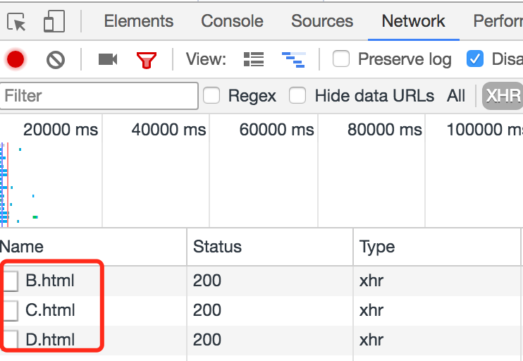
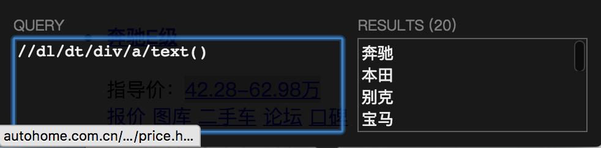

# 【scrapy】爬取汽车车型数据

最近想在工作相关的项目上做技术改进，需要全而准的车型数据，寻寻觅觅而不得，所以就只能自己动手丰衣足食，到网上获（窃）得（取）数据了。

汽车之家是大家公认的数据做的比较好的汽车网站，所以就用它吧。（感谢汽车之家的大大们这么用心地做数据，仰慕）

俗话说的好，“十爬虫九python”，作为一只java狗，我颤颤巍巍地拿起了python想要感受一下scrapy的强大。。。

在写这个爬虫之前，我用urllib2,BeautifulSoup写了一个版本，不过效率太差，而且还有内存溢出的问题，作为python小白感觉很无力，所以用scrapy才是正道。

嗯，开搞。

### 准备工作
1. 安装python，版本是2.7
2. 安装scrapy模块, 版本是1.4.0

### 参考
[Scrapy中文文档](http://scrapy-chs.readthedocs.io/zh_CN/0.24/intro/tutorial.html)：这是Scrapy的中文文档，具体细节可以参照文档。感谢[Summer](https://github.com/marchtea)同学的翻译。

[Xpath教程](http://www.runoob.com/xpath/xpath-tutorial.html)：解析页面数据要用到xpath的语法，简单了解一下，在做的过程中遇到问题去查一下就可以了。

### 初始化工程
scrapy工程的初始化很方便，在shell中的指定目录下执行`scrapy start startproject 项目名称`，就自动化生成了。

> 执行这步的时候遇到了一个问题，抛出了异常`"TLSVersion.TLSv1_1: SSL.OP_NO_TLSv1_1"`，解决方法是执行`sudo pip install twisted==13.1.0`，应该是依赖库版本不兼容。

### 目录结构
工程初始化后，scrapy中的各个元素就被构建好了，不过构建出来的是一副空壳，需要我们往里边写入我们的爬虫逻辑。

初始化后的目录结构是这样的：

* spiders:爬虫目录，爬虫的爬取逻辑就放在个目录下边
* items.py:数据实体类，在这里定义我们爬到的数据结构
* middlewares.py:爬虫中间件（我自己翻译的哈），在这里定义爬取前、爬取后需要处理的逻辑
* pipelines.py:数据管道，爬取后的数据实体会经过数据管道的处理
* settings.py:配置文件，可以在这里配置爬虫的爬取速度，配置中间件、管道是否开启和先后顺序，配置数据输出的格式等。

了解过这些文件的作用后就可以开始写爬虫了。

### 开始吧！
#### 首先，确定要爬取的目标数据。

我的目标是获取汽车的品牌、车系、车型数据，先从品牌开始。

在汽车之家的页面中寻觅一番后，找到了一个爬虫的切入点，[汽车之家车型大全](http://www.autohome.com.cn/car/)。这个页面里有所有品牌的数据，正是我的目标。不过在观察的过程中发现，这个页面里的品牌数据是在页面向下滚动的过程中延迟加载的，这样我们通过请求这个页面不能获取到延迟加载的那部分数据。不过不要慌，看一下延迟加载的方式是什么样的。

打开浏览器控制台的网络请求面板，滚动页面来触发延迟加载，发现浏览器发送了一个异步请求：

复制请求的URL看看：

* http://www.autohome.com.cn/grade/carhtml/B.html
* http://www.autohome.com.cn/grade/carhtml/C.html
* http://www.autohome.com.cn/grade/carhtml/D.html

找到规律了，每一次加载的URL，都只是改变了对应的字母，所以对A到Z分别请求一次就取到了所有的品牌数据。

打开[http://www.autohome.com.cn/grade/carhtml/B.html](http://www.autohome.com.cn/grade/carhtml/B.html)看下，发现页面的数据很规整，是按照品牌-厂商-车系的层级组织的。嗯，正合我意，那就开爬吧。

#### 编写Spider
在spiders目录下边，新建一个*brand_spider.py*文件，在文件中定义*BrandSpider*类，这个类继承了*scrapy.Spider*类，这就是scrapy的*Spider*类。在BrandSpider中，需要声明*name*变量，这是这个爬虫的ID；还需要声明*start_urls*，这是爬虫的起点链接；再定义一个*parse*方法，里面实现爬虫的逻辑。

*parse*方法的入参中，*response*就是对*start_urls*中的链接的请求响应数据，我们要爬取的品牌数据就在这里面，我们需要从*response*中提取出来。从*response*提取数据需要使用xpath语法，参考上边的xpath教程。

提取数据之前，需要先给品牌数据定义一个实体类，因为需要把品牌数据存到数据实体中并落地到磁盘。在*items.py*文件中定义一个*BrandItem*类，这个类继承了*scrapy.Item*类，类中声明了爬取到的、要落地的品牌相关数据，这就是scrapy的*Item*类。

定义好品牌实体后，在*parse*方法中声明一个*BrandItem*实例，然后通过*reponse.xpath*方法取到想要的品牌ID、品牌url、品牌名称、图标url等数据，并设置到*BrandItem*实例中，最后通过*yield*来聚合爬取到的各个品牌数据并返回，返回的数据会进入pipeline。

#### 编写Pipeline
爬取到的数据接着被*pipeline.py*文件中定义的*Pipeline*类处理，这个类通常是对传入的*Item*实体做数据的清洗、排重等工作，可以定义多个*Pipeline*，依次对*Item*处理。由于暂时没有这方面的需要，就不改写这个文件，保持默认状态就好。经过pipeline的处理后，数据进入数据集。

#### 输出csv格式数据
对于爬取到的车型数据，我想以csv的格式输出，并且输出到指定目录下，此时需要修改*settings.py*文件。

在settings.py中添加`FEED_FORMAT = 'csv'`和`FEED_URI = 'data/%(name)s_%(time)s.csv'`两项，目的是指定输出格式为csv，输出到data目录下，以”爬虫名称_爬取时间.csv“格式命名。

#### 执行爬虫
品牌数据的爬虫编写完成了，在项目根目录下执行`scrapy crawl brand`，不出意外的话，在执行了brand爬虫后，会在data目录下出现一个新的csv文件，并且装满了品牌数据。

#### 小心被屏蔽
不过需要注意一个问题，就是当爬虫高频地请求网站接口的时候，有可能会被网站识别出来并且屏蔽掉，因为太高频的请求会对网站的服务器造成压力，所以需要对爬虫限速。

在settings.py中添加`DOWNLOAD_DELAY = 3`，限制爬虫的请求频率为平均3秒一次。

另外，如果爬虫发送的请求头中没有设置user agent也很容易被屏蔽掉，所以要对请求头设置user agent。

在项目根目录下新建`user_agent_middlewares.py`文件，在文件中定义`UserAgentMiddleware`类，继承了`UserAgentMiddleware`类。在`UserAgentMiddleware`中声明*user_agent_list*，存放一些常用的user agent，然后重写*process_request*方法，在*user_agent_list*中随机选取user agent写入请求头中。

###车系、车型爬虫
车系爬虫与上边的品牌爬虫类似，实现在[spiders/series_spider.py](https://github.com/LittleLory/codePool/blob/master/python/autohome_spider/autohome_spider/spiders/series_spider.py)中。

车型爬虫稍微复杂一些，实现在[spiders/model_spider.py](https://github.com/LittleLory/codePool/blob/master/python/autohome_spider/autohome_spider/spiders/model_spider.py)中。车型爬虫要从页面中解析出车型数据，同时要解析出更多的URL添加到请求队列中。而且，车型爬虫爬取的页面并不像品牌数据页面那么规整，所以要根据URL的特征以及页面中的特征来调整解析策略。因此在这里用到了*CrawlSpider*和*Rules*，具体参照[Spider文档](http://scrapy-chs.readthedocs.io/zh_CN/0.24/topics/spiders.html)。

### 总结
以上就实现了一个简单的汽车之家的车型数据爬虫，其中用到了scrapy中的部分元素，当然还有很多元素没有涉及到，不过对于一个简单爬虫来说足矣。

### Tip
在用xpath解析页面的时候，写出来的xpath语句很可能与预期不符，而且调试起来很麻烦，我是用以下方式来提高效率的：

1. 使用chrome上的**XPath Helper**插件。安装好插件，打开目标页面，按*command+shift+x*（mac版的快捷键）打开插件面板，在面板里输入xpath语句，就能看到取到的结果了：
	
	
2. 使用scrapy shell调试。在工程目录下执行`scrapy shell http://www.xxxxx.xx`，之后就会进入python的交互终端，这时就可以进行调试了。执行`print response.xpath('xxxxx')`来验证xpath语句是否符合预期。
